# WE 3D引擎(webGPU engine 3D)

## 基础说明

* WE 3D 是一个从底层完全独立架构的B端三维渲染引擎；
* 以TypeScript为开发语言；
* 在光栅化是以webGPU进行架构处理的，而且只支持webGPU的光栅化库；
* 渲染引擎架构架构上，参考了UE、cesium的部分工作原理；
* 在底层形成以command集合（Draw Command、Compute Command、Copy Command）；
* 在更新机制上形成以对象和类的update为更新入口的按需更新机制；
* 在GPU的shader上支持Draw shader、Compute shader，以及多重shader串行输出一个Draw或Compute的command；（封装了webGPU原生的功能并集成与扩展）

## 更多功能

* 渲染模式支持前向渲染和延迟渲，分成场景渲染和非场景渲染；
* 延迟渲染可能会有两种方式：延迟单像素前向方式和前向颜色延迟光照渲染；
* 渲染通道支持多GBuffer默认8个（32byte大小的单点数据量，可扩展到128大小Dawn核心的）如：depth、normal、uv、entityID、stageID、instanceID等；
* 支持多GBuffer的可视化可以通过console命令行进行调试；
* 支持基于GPU的GBuffer的拾取；
* 支持正常depth渲染模式和Reversed Z渲染（以提高Z轴精度）;
* 材质部分提供了简单材质Buli-Phong为基础的基础材质，和以PBR（进行中）为核心的物理材质。在PBR材质上是主要参考filament的文档进行的，并借鉴了UE的材质（材质编辑器）；
* 在物体对象（entities）上将支持多种扩展形式，包括基础的点、线、面，几何体（mesh）、有限元仿真数据、各种模型文件、大地形、体素对象等；
* 物体的空间组织上采用BVH和BOX3结合的方式；
* 光源支持环境光、点光源、定向光源、聚光灯、以及shape光源（短期todo）；
* 光源长期todo的有光体积（前端计算量不太适用，即便在worker中）、光探针；
* 在阴影部分以shadowmap为主；
* 在活动对象上以Actor对象理念为核心；
* 摄像机支持投射、正交、多视口功能；摄像机是Actor对象形式存在（CameraActor），摄像机的运动与控制也是Actor的理念；
* 在光线拾取上有GPU拾取和CPU拾取两种模式；
* 后期处理的效果上目前基本是参照threejs的方式，会形成一个有意思的特效吧，比如丁达尔效果等；
* 在后期处理及之后的渲染工作流中，会保存scene、stage的输出纹理，为cache渲染、TAA等流程使用；
* 在Stage舞台目前初步设定五个：UI、sky、world、dynamic、actor。其中后三个分别有透明和不透明两个子舞台；
* 短期的规划还有：SSGI、SSR、SSAO、IBL、GI with Reflective shadow maps(这个感觉babylon的挺好的)；

## API文档

* API文档在doc目录下，使用TypeDoc生成；
* 示例文档，todo

## 运行示例

| 拾取                                              | 反向Z                                             | GBuffer可视化                                     |
| ------------------------------------------------- | ------------------------------------------------- | ------------------------------------------------- |
| 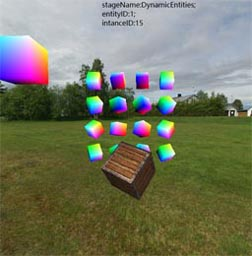 | 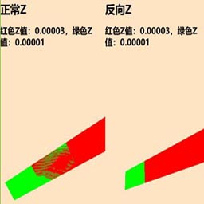 | 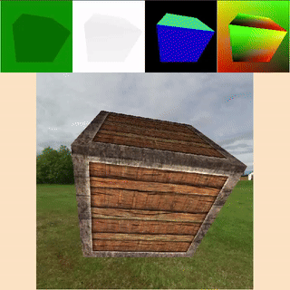 |
| 后处理：模糊，3x3卷积                             | 延迟渲染 1024个光源                               | 多摄像机                                          |
| 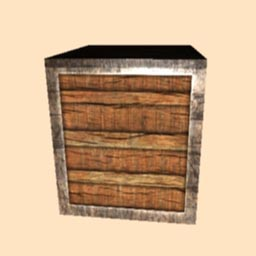 | 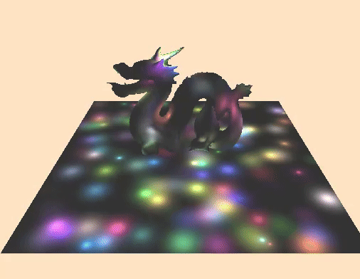 | 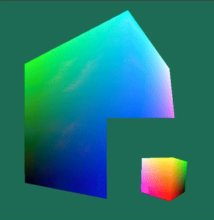 |
| shadow map 可视化                                 | 光源+阴影：方向光                                 | 软阴影PCSS                                        |
| 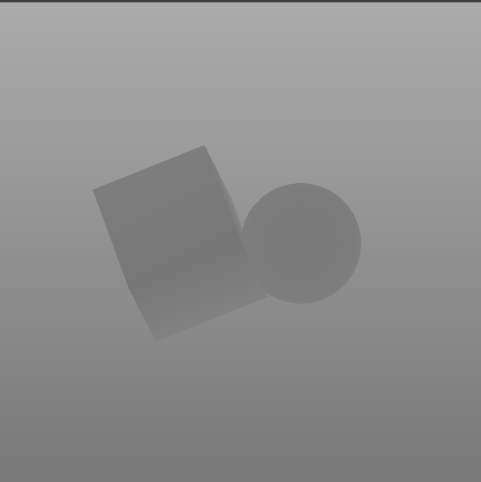 | 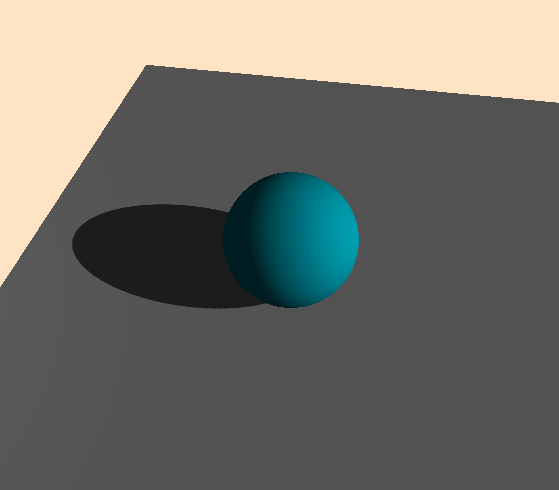 | 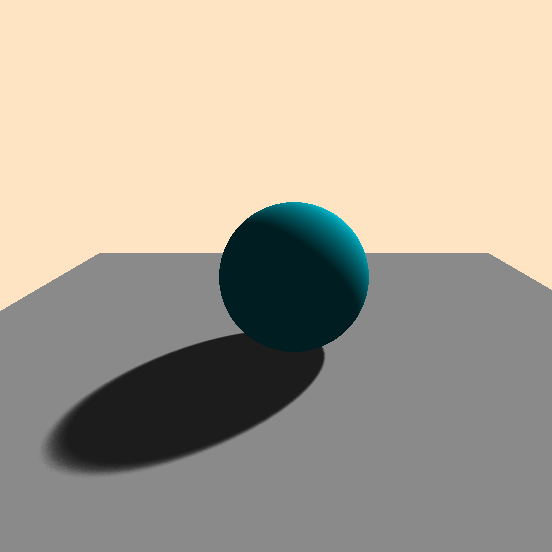 |
| 软阴影+动态光源位置                               | 光源+阴影：点光源                                 | 光源+阴影：spot                                   |
| 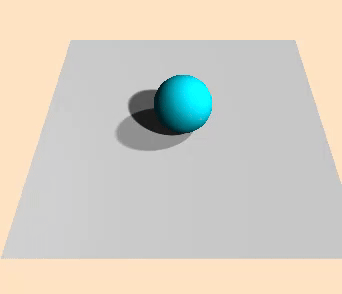 |                                                   | 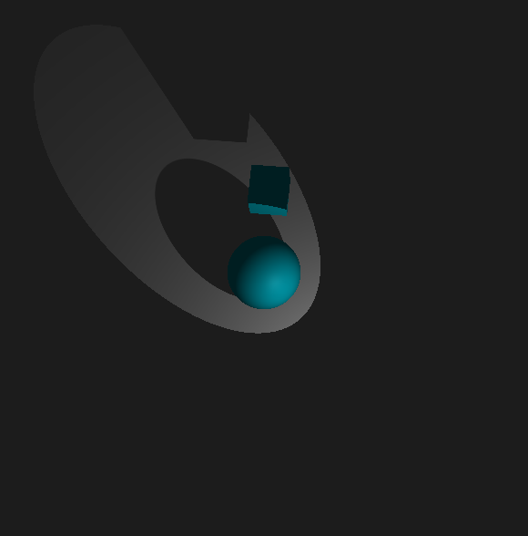 |
| 视频纹理                                          | lightmap                                          | 粒子系统                                          |
|                                                   |                                                   |                                                   |
| Skinned Mesh                                      | 体积渲染                                          | 仿真云图                                          |
|                                                   |                                                   |                                                   |
| 文本渲染                                          | PBR                                               | PBR                                               |
|                                                   |                                                   |                                                   |
| PBR                                               | PBR                                               | PBR                                               |
|                                                   |                                                   |                                                   |
| camera可视区域优化与剔除                          |                                                   |                                                   |
|                                                   |                                                   |                                                   |

## Todo

* 粒子系统目前还没有开始设计；
* 流体模拟系统刚刚开始架构，这部分可能会有两个部分，模拟效果部分和数据驱动部分（仿真数据或计算数据）；
* PBR的材质编辑器；
* 材质预计算部分；
* 场景编辑器；
* 预加载与资格管理部分；
* 资源打包格式与输出部分；

## 相关资料与推荐

* https://www.w3.org/TR/webgpu/
* https://www.w3.org/TR/wgsl/
* https://github.com/webgpu/webgpu-samples
* https://github.com/gfx-rs/wgpu
* https://developer.mozilla.org/zh-CN/docs/Web/API/WebGPU_API
* https://github.com/webgpu/webgpufundamentals
* https://webgpufundamentals.org/
* https://webgl2fundamentals.org/
* https://webglfundamentals.org/
* https://github.com/webgpu/webgpu-samples
* https://github.com/greggman/wgpu-matrix
* https://github.com/toji/gl-matrix
* WebGPU API reference https://gpuweb.github.io/types/index.html
* https://github.com/greggman/webgpu-utils
* https://github.com/google/filament
* https://github.com/google/dawn

## 感谢

**从入坑图形学到现在，陆陆续续学习了较多的知识，感谢图形学方面无私奉献开源工作者和进行图形学公开课的老师们。**

* 感谢胡事民老师的计算机图形学公开课程；
* 感谢闫令琪老师的Games101和Games202的课程；
* 感谢LearnOpenGL中文化工程 https://learnopengl-cn.github.io/ ；
* 感谢LearnOpengl的原书作者 JoeyDeVries https://learnopengl.com ；
* 感谢Filament的文档作者Romain Guy,Mathias Agopian ；

## 写在最后

开发WE引擎还是工作量比较重的，学习、设计、代码、测试、文档、示例都是一个人，但收获也是满满的。

希望将WE 引擎一直迭代下去，也希望若有志同道合的道友可以一起开发；
