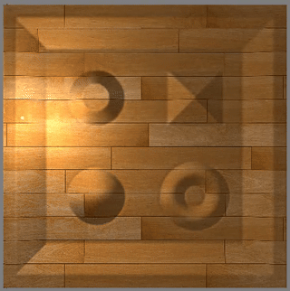

# WE 3D引擎(webGPU engine 3D)

## 基础说明

* WE 3D 是是图形学的认知与实现过程，也是一个从底层架构的B端三维渲染引擎；
* 以TypeScript为开发语言；
* 在光栅化是以webGPU进行架构处理的，而且只支持webGPU库；
* 渲染引擎架构架构上，参考了UE、cesium、threejs的部分工作原理；
* 以计算机图形学的渲染功能为主，未涉及游戏引擎架构，也没有ECS等；
* 在底层绘制上以command集合（Draw Command、Compute Command、Copy Command）进行shader提交；
* 在更新机制上有三个更新机制，对象的update机制、run（）的入口function机制、用户自定义更新机制；
* 在GPU的shader上支持Draw shader、Compute shader，以及多重shader串行输出一个Draw或Compute的command；（封装了webGPU原生的功能并集成与扩展）；

## 更多功能

* 渲染模式支持前向渲染和延迟渲，分成场景渲染和非场景渲染；
* 延迟渲染可能会有两种方式：延迟单像素前向方式和前向颜色延迟光照渲染；
* 渲染通道支持多GBuffer默认8个（32byte大小的单点数据量，可扩展到128大小Dawn核心的）如：depth、normal、uv、entityID、stageID、instanceID等；
* 支持多GBuffer的可视化可以通过console命令行进行调试；
* 支持基于GPU的GBuffer的拾取；
* 支持正常depth渲染模式和Reversed Z渲染（以提高Z轴精度）;
* 材质部分提供了简单材质Buli-Phong为基础的基础材质，和以PBR（进行中）为核心的物理材质。在PBR材质上是主要参考learnOpengl、filament的文档进行的，并借鉴了UE的材质编辑器方向；
* 在物体对象（entities）上将支持多种扩展形式，包括基础的点、线、面，几何体（mesh）、有限元仿真数据、各种模型文件、大地形、体素对象等；
* 物体的空间组织上采用BVH和BOX3结合的方式；
* 光源支持环境光、点光源、定向光源、聚光灯、以及shape光源（短期todo）；
* 光源长期todo的有体积光（前端计算量不太适用，即便在worker中）、光探针；
* 在阴影部分以shadowmap为主；
* 在活动对象上以Actor对象理念为核心；
* 摄像机支持投射、正交、多视口功能；摄像机是Actor对象形式存在（CameraActor），摄像机的运动与控制也是Actor的理念；
* 在光线拾取上有GPU拾取和CPU拾取两种模式；
* 后期处理的效果上目前基本是参照threejs的方式，会形成一个有意思的特效吧，比如丁达尔效果等；
* 在后期处理及之后的渲染工作流中，会保存scene、stage的输出纹理，为cache渲染、TAA等流程使用；
* 在Stage舞台目前初步设定五个：UI、sky、world、dynamic、actor。其中后三个分别有透明和不透明两个子舞台；
* 短期的规划还有：SSGI、SSR、SSAO、IBL；

## API文档

* API文档在doc目录下，使用TypeDoc生成；
* 示例文档，examples目录下；

## 运行示例

| 拾取                                              | 反向Z                                             | GBuffer可视化                                     |
| ------------------------------------------------- | ------------------------------------------------- | ------------------------------------------------- |
|  |  |  |
| 后处理：模糊，3x3卷积                             | 延迟渲染 1024个光源                               | 多摄像机+多viewport                               |
|  |  |  |
| shadow map 可视化                                 | 光阴影：方向光                                    | 软阴影PCSS                                        |
|  |  |  |
| 软阴影+动态光源                                   | 阴影：点光源                                      | 阴影：spot                                        |
|  |  |  |
| 动态点光源阴影                                    | 混合(克隆webgpufundamentals)                      | 透明材质                                          |
|  |  |  |
| 透明渲染                                          | 纹理材质                                          | 纹理材质：贴花,alphatest                          |
|  |  |  |
| Blinn-Phong 高光贴图                              | 法线纹理                                          | 视差纹理                                          |
|  |  |  |
| 视频材质                                          | mipmap                                            | PBR:Cook-Torrance BRDF                            |
|  |  |  |
| PBR:Cook-Torrance 纹理BRDF                        | IBL                                               | PBR+IBL                                           |
|  |                                                   |                                                   |
| SSGI                                              | SSR                                               | SSAO                                              |
|                                                   |                                                   |                                                   |
| BVH                                               | GLTF                                              | OBJ                                               |
|                                                   |                                                   |                                                   |
| FBX                                               | 点entity                                          | 线entity                                          |
|                                                   |                                                   |                                                   |
| sprite entity                                    | Skinned Mesh                                      | 文本渲染                                          |
|                                                   |                                                   |                                                   |
| MSAA                                              | FXAA                                              | TAA                                               |
|                                                   |                                                   |                                                   |
| 粒子系统                                          | 动画                                              | 仿真云图                                          |
|                                                   |                                                   |                                                   |
| 后处理：描边                                      | 后处理：Bloom                                     | HDR                                               |
|                                                   |                                                   |                                                   |
| 半透明阴影                                        | 体渲染                                            | 体渲染                                            |
|                                                   |                                                   |                                                   |
| shape light                                       | PBR多层材质                                       | 半透明PBR                                         |
|                                                   |                                                   |                                                   |
|                                                   |                                                   |                                                   |
|                                                   |                                                   |                                                   |
|                                                   |                                                   |                                                   |
|                                                   |                                                   |                                                   |

## Demo

| 名称          | 说明                 | 动图 |
| ------------- | -------------------- | ---- |
| 仿真云图      | 有限元仿真后处理示例 | todo |
| ocean         | 复制babylon的ocean   | todo |
| PBR材质编辑器 |                      | todo |
| 编辑器        | 项目编辑器           | todo |
|               |                      |      |
|               |                      |      |
|               |                      |      |
|               |                      |      |

## Todo

* 粒子系统目前还没有开始设计；
* 流体模拟系统刚刚开始架构，这部分可能会有两个部分，模拟效果部分和数据驱动部分（仿真数据或计算数据）；
* PBR的材质编辑器；
* 材质预计算部分；
* 场景编辑器；
* 预加载与资格管理部分；
* 资源打包格式与输出部分；

## 相关资料与推荐

* webGPU标准：https://www.w3.org/TR/webgpu/
* WGSL的标准：https://www.w3.org/TR/wgsl/
* 非常好示例：https://github.com/webgpu/webgpu-samples
* google的Dawn：https://github.com/google/dawn
* Mozilla的wGPU：https://github.com/gfx-rs/wgpu
* MDN的webGPU文档：https://developer.mozilla.org/zh-CN/docs/Web/API/WebGPU_API
* 非常好的webGPU教程：https://webgpufundamentals.org/
* 非常好的webGL2教程：https://webgl2fundamentals.org/
* 非常好的webGL1教程：https://webglfundamentals.org/
* dawn 的C示例：https://github.com/samdauwe/webgpu-native-examples
* 非常实用的JS端的图形学简单数学库，这是目前主要使用的库：https://github.com/greggman/wgpu-matrix
* 另外一个经典的图形学数学库：https://github.com/toji/gl-matrix
* WebGPU API reference，方便实用：https://gpuweb.github.io/types/index.html
* webgpu-utils可以参考一下：https://github.com/greggman/webgpu-utils
* filament可以学习与参考一些：https://github.com/google/filament
* PBRT书籍，非常好：https://www.pbr-book.org/
* Ray tracing的书籍：https://raytracing.github.io/
* nvidia的书籍：https://developer.nvidia.com/gpugems/gpugems/contributors

## 感谢

**从入坑图形学到现在，陆陆续续学习了较多的知识，感谢图形学方面无私奉献开源工作者和进行图形学公开课的老师们。**

* 感谢胡事民老师的计算机图形学公开课程；
* 感谢闫令琪老师的Games101和Games202的课程；
* 感谢LearnOpenGL中文化工程 https://learnopengl-cn.github.io/ ；
* 感谢LearnOpengl的原书作者 JoeyDeVries https://learnopengl.com ；
* 感谢Filament的文档作者Romain Guy,Mathias Agopian ；
* 感谢的PBRT(https://pbrt.org/)的作者们；

## 写在最后

WE引擎是计算机图形学和引擎架构的认知与实现过程。
